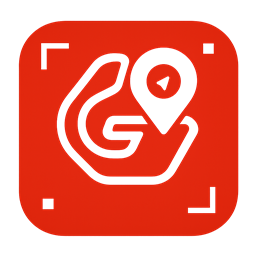
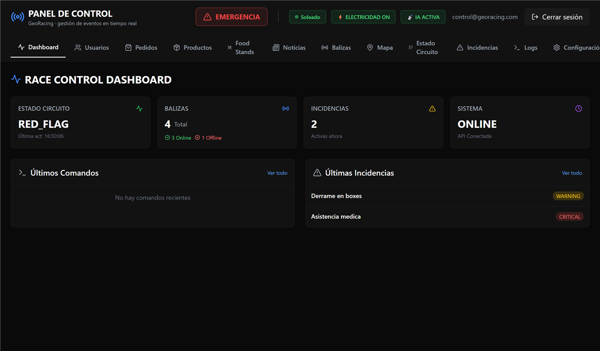
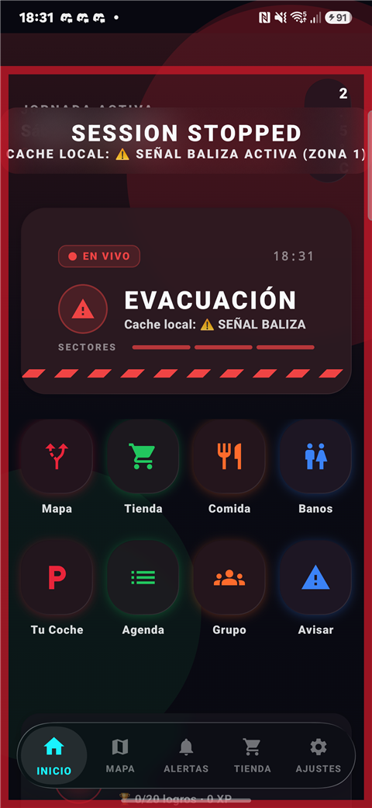
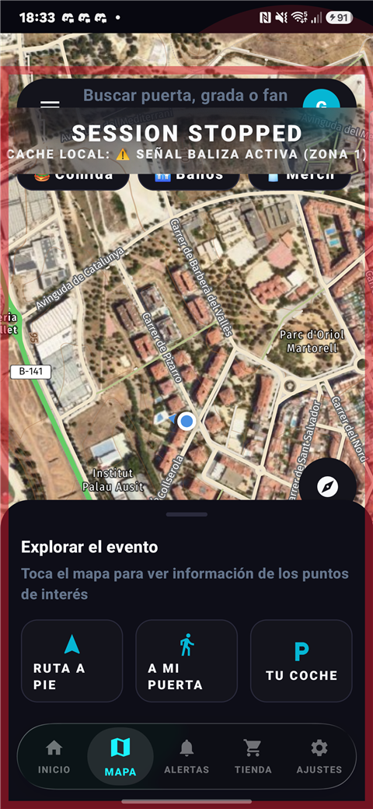
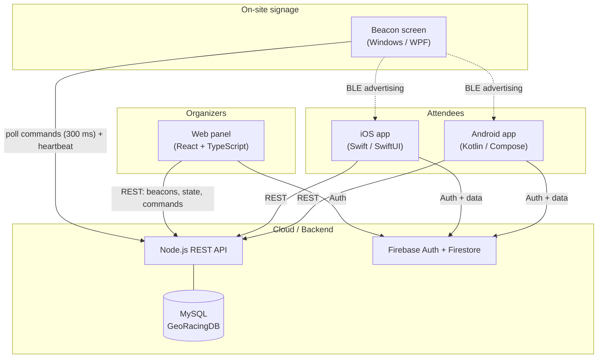

<p align="center">
  
</p>

<h1 align="center">GeoRacing</h1>

<p align="center"><strong>Real-time digital circuit signage and event experience platform for motorsport venues.</strong></p>

<p align="center">
  
  
  
  
  
  
  
  
  
</p>

<p align="center">
  
</p>

---

## What is GeoRacing?

Large motorsport events face a real communication problem: tens of thousands of attendees spread across grandstands, paddocks, fan zones and parking areas, with no reliable way to receive safety-critical information (red flags, safety car, evacuations) or to find their way around the venue. Traditional static signage cannot react to a live event.

GeoRacing solves this with a network of **smart physical beacons** — screens driven by Windows mini-PCs that both display remotely-controlled signage *and* advertise their zone over **Bluetooth Low Energy** — combined with **attendee mobile apps** (Android and iOS) that show a live circuit map, real-time flag status, pedestrian navigation, group location sharing and food ordering. When an operator triggers an evacuation from the **web control panel**, every beacon switches to evacuation mode with directional arrows within ~300 ms, and nearby phones guide their users to the closest exit using the BLE signals.

The platform is composed of five components: native Android and iOS apps for attendees, a React control panel for the organization, C#/.NET beacon software for the on-site Windows screens, and a Node.js + MySQL REST API at the core.

## Screenshots

<p align="center">
  
  &nbsp;&nbsp;
  
</p>

> Android attendee app: a real-time evacuation alert driven by the circuit state / BLE beacons (left), and the circuit map with POIs and on-foot routing (right). The image at the top is the real React control panel running against the API.

## Architecture



Beacons never receive pushes — they poll the API for pending commands and report heartbeats; the panel writes commands and reads beacon state through the same API. BLE is one-way: beacons advertise a compact 9-byte payload (zone, mode, sequence, TTL, temperature) that the apps scan to determine the user's zone and the nearest signage state. See [docs/ARCHITECTURE.md](docs/ARCHITECTURE.md) for the full picture.

## Components

| Component | Path | Stack | Description |
|---|---|---|---|
| Android app | [`android`](android/README.md) | Kotlin, Jetpack Compose, Retrofit, Room, MapLibre, Firebase, Android Auto | Attendee app: interactive circuit map, real-time flags and safety-car status, BLE zone detection, pedestrian navigation, group location sharing, food orders, battery survival mode |
| iOS app | [`ios`](ios/README.md) | Swift, SwiftUI, MapKit, CoreBluetooth, CarPlay, Firebase | Feature-parity attendee app for iOS, including Fan Zone, quizzes and cart-based ordering |
| Web panel | [`web`](web/README.md) | React, TypeScript, Vite, Tailwind, Firebase | Organizer control panel: beacon fleet management and remote commands, circuit state, evacuations, incidents, orders, news, users, live metrics |
| REST API | [`api`](api/README.md) | Node.js, Express, MySQL | REST API at the core of the system: beacons, zones, circuit state, command queue, heartbeats |
| Windows beacon | [`windows`](windows/BeaconApp/README.md) | C# / .NET (WPF, WinRT BLE) | Software for the physical signage screens: full-screen remotely-configured display plus one-way BLE advertising |
| Documentation | [`docs`](docs/ARCHITECTURE.md) | Markdown | Global architecture, data flows, BLE protocol and REST API reference |

## Feature matrix

| Capability | Android | iOS | Web panel | Windows beacon |
|---|:---:|:---:|:---:|:---:|
| Live circuit state (flags / safety car / red flag) | ✅ | ✅ | ✅ | ✅ |
| Evacuation mode with directional arrows | ✅ | ✅ | ✅ | ✅ |
| BLE zone detection / advertising | ✅ | ◐ | — | ✅ |
| Interactive circuit map | ✅ | ✅ | ✅ (zones) | — |
| Pedestrian navigation + voice guidance | ✅ | ◐ | — | — |
| Group location sharing | ✅ | ✅ | — | — |
| Food ordering / orders management | ✅ | ✅ | ✅ | — |
| Incidents reporting / triage | ✅ | ✅ | ✅ | — |
| Android Auto / CarPlay | ✅ | ◐ | — | — |
| Remote command + heartbeat | — | — | ✅ | ✅ |

✅ implemented · ◐ partial / in progress · — not applicable

## Testing

The project ships **212 automated tests** that run in CI on every push:

| Component | Framework | Tests | Run locally |
|---|---|:---:|---|
| Web panel | Vitest | 47 | `cd web && npm test` |
| Android | JUnit (JVM unit tests) | 116 | `cd android && ./gradlew testDebugUnitTest` |
| API | `node --test` | 49 | `cd api && npm test` |

The web panel additionally enforces `npm run lint` (ESLint, zero warnings) and a
strict `tsc` typecheck as part of `npm run build`. See [.github/workflows](.github/workflows)
for the CI definitions and [docs/BUG_AUDIT.md](docs/BUG_AUDIT.md) for the audit
that produced these suites.

## Repository layout

```
GeoRacing/
├── README.md                 # You are here
├── CONTRIBUTING.md           # How to build, run and contribute
├── SETUP.md                  # Credentials/config to fill in per component
├── LICENSE                   # MIT
├── android/                  # Android attendee app (Kotlin + Compose)
├── ios/                      # iOS attendee app (Swift + SwiftUI)
├── web/                      # Organizer control panel (React + TS + Vite)
├── api/                      # Node.js + Express + MySQL REST API
├── windows/                  # WPF beacon screen app (signage + BLE)
└── docs/
    ├── ARCHITECTURE.md       # Global technical documentation (English)
    ├── documentation.md      # Original global documentation (Spanish)
    └── assets/               # Logo and images
```

## Getting started

> **Credentials:** this repo ships no real keys — every secret is a placeholder.
> See **[SETUP.md](SETUP.md)** for exactly what to fill in per component.

Each component is self-contained and has its own README with detailed setup instructions. In short:

- **REST API** — `cd api && npm install`, set the `DB_*` environment variables, then `node server.js`. See [api/README.md](api/README.md).
- **Web panel** — `cd web && npm install`, configure your Firebase project, then `npm run dev`. See [web/README.md](web/README.md).
- **Android app** — open `android` in Android Studio and add your own `google-services.json`. See [android/README.md](android/README.md).
- **iOS app** — open the Xcode project in `ios` and add your own `GoogleService-Info.plist`. See [ios/README.md](ios/README.md).
- **Windows beacon** — open `windows/GeoRacingBeacon.sln` with Visual Studio on Windows (BLE advertising requires WinRT APIs). See [windows/BeaconApp/README.md](windows/BeaconApp/README.md).

All credentials are injected via environment variables or local config files that are not part of this repository — `.example` templates are provided where relevant.

## Roadmap

A full traceability matrix of every product idea (5 resilience pillars + 66
backlog items) against the real code — plus a second-wave backlog of new ideas —
lives in [docs/IDEA_COVERAGE.md](docs/IDEA_COVERAGE.md).

## Contributing

Contributions are welcome. Please read [CONTRIBUTING.md](CONTRIBUTING.md) for
per-component dev setup and conventions, and our [Code of Conduct](CODE_OF_CONDUCT.md).
Security issues: see [SECURITY.md](SECURITY.md). Release notes live in
[CHANGELOG.md](CHANGELOG.md).

## License

Released under the [MIT License](LICENSE). As a courtesy (not a license term), if
you build a product on GeoRacing or its ideas, a quick heads-up to
**gerard.alpo17@gmail.com** is appreciated.

> **Note:** this repository is a curated export of the original project workspace. Build artifacts, duplicated versions and all credentials were removed before publication.
