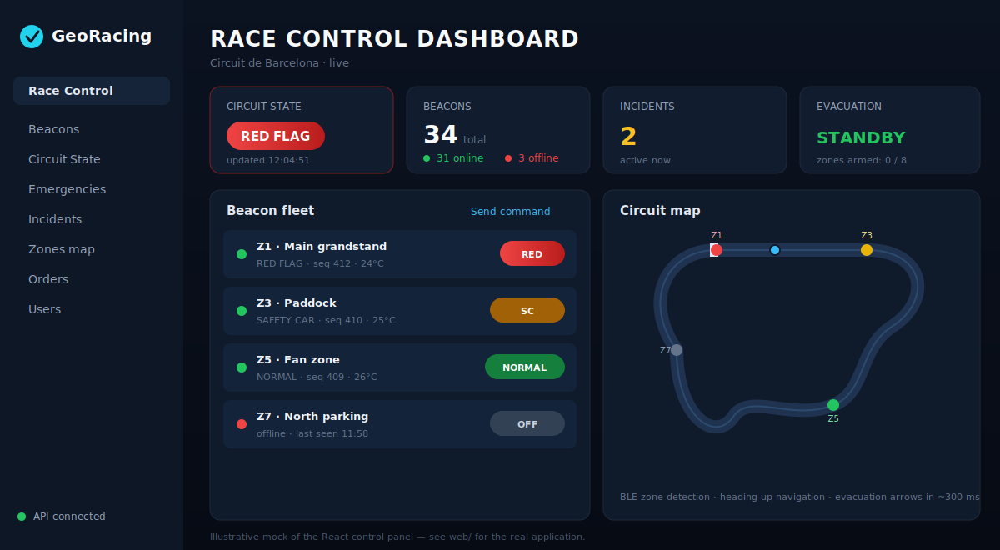
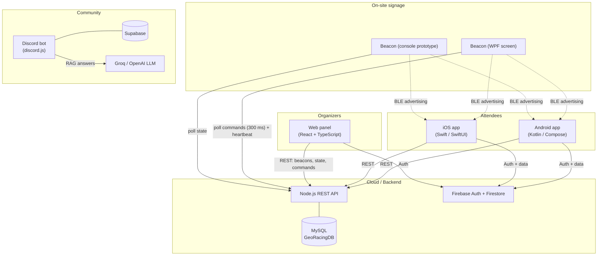

<p align="center">
  
</p>

<h1 align="center">GeoRacing</h1>

<p align="center"><strong>Real-time digital circuit signage and event experience platform for motorsport venues.</strong></p>

<p align="center">
  
  
  
  
  
  
  
  
  
</p>

<p align="center">
  
</p>

---

## What is GeoRacing?

Large motorsport events face a real communication problem: tens of thousands of attendees spread across grandstands, paddocks, fan zones and parking areas, with no reliable way to receive safety-critical information (red flags, safety car, evacuations) or to find their way around the venue. Traditional static signage cannot react to a live event.

GeoRacing solves this with a network of **smart physical beacons** — screens driven by Windows mini-PCs that both display remotely-controlled signage *and* advertise their zone over **Bluetooth Low Energy** — combined with **attendee mobile apps** (Android and iOS) that show a live circuit map, real-time flag status, pedestrian navigation, group location sharing and food ordering. When an operator triggers an evacuation from the **web control panel**, every beacon switches to evacuation mode with directional arrows within ~300 ms, and nearby phones guide their users to the closest exit using the BLE signals.

The platform is composed of six components: native Android and iOS apps for attendees, a React control panel for the organization, C#/.NET beacon software, a Node.js + MySQL REST API at the core, and a Discord community bot with AI-powered Q&A.

## Architecture



Beacons never receive pushes — they poll the API for pending commands and report heartbeats; the panel writes commands and reads beacon state through the same API. BLE is one-way: beacons advertise a compact 9-byte payload (zone, mode, sequence, TTL, temperature) that the apps scan to determine the user's zone and the nearest signage state. The Discord bot is an independent community service backed by Supabase and an LLM. See [docs/ARCHITECTURE.md](docs/ARCHITECTURE.md) for the full picture.

## Components

| Component | Path | Stack | Description |
|---|---|---|---|
| Android app | [`apps/android`](apps/android/README.md) | Kotlin, Jetpack Compose, Retrofit, Room, MapLibre, Firebase, Android Auto | Attendee app: interactive circuit map, real-time flags and safety-car status, BLE zone detection, pedestrian navigation, group location sharing, food orders, battery survival mode |
| iOS app | [`apps/ios`](apps/ios/README.md) | Swift, SwiftUI, MapKit, CoreBluetooth, CarPlay, Firebase | Feature-parity attendee app for iOS, including Fan Zone, quizzes and cart-based ordering |
| Web panel | [`web-panel`](web-panel/README.md) | React, TypeScript, Vite, Tailwind, Firebase | Organizer control panel: beacon fleet management and remote commands, circuit state, evacuations, incidents, orders, news, users, live metrics |
| Backend API | [`backend`](backend/README.md) | Node.js, Express, MySQL | REST API at the core of the system: beacons, zones, circuit state, command queue, heartbeats |
| Beacon apps | [`beacons`](beacons/README.md) | C# / .NET (WPF, WinRT BLE) | Software for the physical signage beacons: full-screen remotely-configured display plus BLE advertising; includes a console prototype |
| Discord bot | [`discord-bot`](discord-bot/README.md) | Node.js, discord.js, Supabase, Groq | Community bot with realtime Supabase listener and AI (RAG) answers about the project |
| Documentation | [`docs`](docs/ARCHITECTURE.md) | Markdown | Global architecture, data flows, BLE protocol and REST API reference |

## Feature matrix

| Capability | Android | iOS | Web panel | Beacons |
|---|:---:|:---:|:---:|:---:|
| Live circuit state (flags / safety car / red flag) | ✅ | ✅ | ✅ | ✅ |
| Evacuation mode with directional arrows | ✅ | ✅ | ✅ | ✅ |
| BLE zone detection / advertising | ✅ | ◐ | — | ✅ |
| Interactive circuit map | ✅ | ✅ | ✅ (zones) | — |
| Pedestrian navigation + voice guidance | ✅ | ◐ | — | — |
| Group location sharing | ✅ | ✅ | — | — |
| Food ordering / orders management | ✅ | ✅ | ✅ | — |
| Incidents reporting / triage | ✅ | ✅ | ✅ | — |
| Android Auto / CarPlay | ✅ | ◐ | — | — |
| Remote command + heartbeat | — | — | ✅ | ✅ |

✅ implemented · ◐ partial / in progress · — not applicable

## Testing

The project ships **194 automated tests** that run in CI on every push:

| Component | Framework | Tests | Run locally |
|---|---|:---:|---|
| Web panel | Vitest | 37 | `cd web-panel && npm test` |
| Android | JUnit (JVM unit tests) | 116 | `cd apps/android && ./gradlew testDebugUnitTest` |
| Backend | `node --test` | 24 | `cd backend && npm test` |
| Discord bot | `node --test` | 17 | `cd discord-bot && npm test` |

The web panel additionally enforces `npm run lint` (ESLint, zero warnings) and a
strict `tsc` typecheck as part of `npm run build`. See [.github/workflows](.github/workflows)
for the CI definitions and [docs/BUG_AUDIT.md](docs/BUG_AUDIT.md) for the audit
that produced these suites.

## Repository layout

```
GeoRacing-publish/
├── README.md                 # You are here
├── CONTRIBUTING.md           # How to build, run and contribute
├── LICENSE                   # MIT
├── apps/
│   ├── android/              # Android attendee app (Kotlin + Compose)
│   └── ios/                  # iOS attendee app (Swift + SwiftUI)
├── web-panel/                # Organizer control panel (React + TS + Vite)
├── backend/                  # Node.js + Express + MySQL REST API
├── beacons/
│   ├── baliza-noah/          # WPF beacon app (full-screen signage + BLE)
│   └── baliza-gerard/        # Console beacon prototype (active BLE)
├── discord-bot/              # Community bot (discord.js + Supabase + Groq)
└── docs/
    ├── ARCHITECTURE.md       # Global technical documentation (English)
    ├── documentation.md      # Original global documentation (Spanish)
    └── assets/               # Logo and images
```

## Getting started

> **Credentials:** this repo ships no real keys — every secret is a placeholder.
> See **[SETUP.md](SETUP.md)** for exactly what to fill in per component.

Each component is self-contained and has its own README with detailed setup instructions. In short:

- **Backend API** — `cd backend && npm install`, set the `DB_*` environment variables, then `node server.js`. See [backend/README.md](backend/README.md).
- **Web panel** — `cd web-panel && npm install`, configure your Firebase project, then `npm run dev`. See [web-panel/README.md](web-panel/README.md).
- **Android app** — open `apps/android` in Android Studio and add your own `google-services.json`. See [apps/android/README.md](apps/android/README.md).
- **iOS app** — open the Xcode project in `apps/ios` and add your own `GoogleService-Info.plist`. See [apps/ios/README.md](apps/ios/README.md).
- **Beacons** — open the solutions in `beacons/` with Visual Studio on Windows (BLE advertising requires WinRT APIs). See [beacons/README.md](beacons/README.md).
- **Discord bot** — `cd discord-bot && npm install`, fill in your `.env`, then `node index.js`. See [discord-bot/README.md](discord-bot/README.md).

All credentials are injected via environment variables or local config files that are not part of this repository — `.example` templates are provided where relevant.

## Contributing

Contributions are welcome. Please read [CONTRIBUTING.md](CONTRIBUTING.md) for
per-component dev setup and conventions, and our [Code of Conduct](CODE_OF_CONDUCT.md).
Security issues: see [SECURITY.md](SECURITY.md). Release notes live in
[CHANGELOG.md](CHANGELOG.md).

## Team

| Member | Areas |
|---|---|
| **Gerard** | Android app, backend API, beacon BLE prototype |
| **Dani** | Discord bot, iOS app |
| **Noah** | Beacon desktop apps |

## License

Released under the [MIT License](LICENSE).

> **Note:** this repository is a curated export of the original team workspace. Build artifacts, duplicated assets and all credentials were removed before publication.
