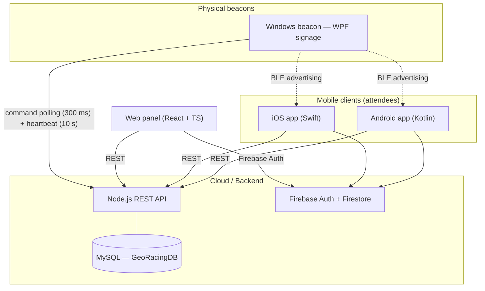
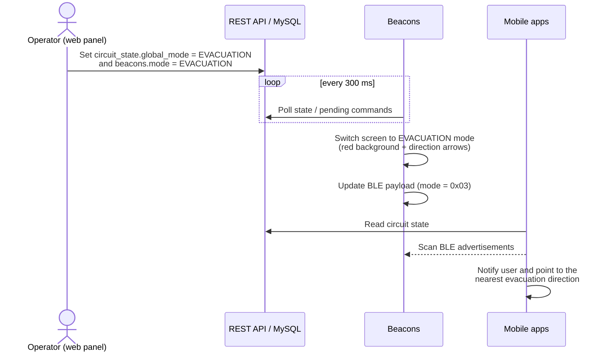

# GeoRacing — System Architecture

> English, structured version of the original global documentation ([documentation.md](documentation.md)). The original file is kept as-is for reference.

## Table of contents

1. [Overview](#overview)
2. [System architecture](#system-architecture)
3. [Components](#components)
4. [Global data flows](#global-data-flows)
5. [Database](#database)
6. [BLE protocol](#ble-protocol)
7. [REST API](#rest-api)
8. [Technology stack](#technology-stack)

---

## Overview

**GeoRacing** is a management and experience platform for motorsport events (Formula 1-style circuit racing). It provides:

- **Real-time information** for event attendees through native mobile apps.
- **Centralized event management** through a web control panel for the organization staff.
- **Smart physical signage** through beacons (screens driven by a PC or Raspberry Pi) distributed around the circuit, displaying circuit status, evacuation routes, directions and custom messages.

| Component | Path | Technology | Role |
|---|---|---|---|
| Android app | `android` | Kotlin + Jetpack Compose | Attendee app (Android) |
| iOS app | `ios` | Swift + SwiftUI | Attendee app (iOS) |
| Web panel | `web` | React + TypeScript + Vite | Organizer control panel |
| Windows beacon | `windows` | C# + WPF (.NET) | Full-screen signage beacon with UI |
| API | `api` | Node.js + Express + MySQL | Core REST API |

## System architecture

Key properties:

- The **REST API + MySQL** pair is the single source of truth for beacons, commands, zones and circuit state.
- **Firebase** provides authentication for the web panel and auxiliary data (Auth + Firestore) for the mobile apps.
- **Beacons are pull-based**: they poll the API for pending commands and report heartbeats; nothing pushes to them.
- **BLE is one-way**: beacons advertise; phones scan to determine proximity and zone.

## Components

### Android app (`android`)

Attendee-facing Android application.

- Circuit map with POIs (MapLibre)
- Pedestrian navigation inside the venue
- Real-time circuit status (red flag, safety car, evacuation)
- Groups: location sharing with friends
- Shop / food ordering
- Android Auto integration
- Battery survival mode
- BLE scanning to detect nearby beacons
- Basic augmented reality

### iOS app (`ios`)

Attendee-facing iOS application with feature parity targets relative to Android.

- MapKit map + navigation routes
- CarPlay integration
- Groups and shared location
- BLE beacon scanning (CoreBluetooth)
- News and Fan Zone
- Quiz and gamification
- Cart-based ordering

### Web panel (`web`)

Control panel for the event organization staff.

- Real-time metrics dashboard
- Full beacon fleet management (configuration, remote commands, live status)
- Emergency and evacuation management
- Global circuit state
- Incident management
- Zone map
- Orders and product management
- Fan news publishing
- User management

### Windows beacon — WPF signage (`windows`)

Windows signage application with a full-screen WPF UI.

- Polls the API every **300 ms** for pending commands
- Sends a **heartbeat every 10 s** to register presence
- BLE advertising of the zone payload
- Modes: `NORMAL`, `CONGESTION`, `EMERGENCY`, `EVACUATION`, `MAINTENANCE`
- Direction arrows configurable from the web panel
- Remote screen-brightness control
- Supported commands: `RESTART`, `SHUTDOWN`, `CLOSE_APP`, `UPDATE_CONFIG`

## Global data flows

### Emergency evacuation flow

### Beacon configuration flow

1. Operator edits a beacon's configuration in the web panel UI.
2. The panel writes an `UPDATE_CONFIG` command into the `commands` table and updates the `beacons` row.
3. The beacon picks up the command on its next poll (≤ 300 ms).
4. The beacon updates its display: mode, message, arrows, color, brightness.
5. The beacon marks the command as executed (the command is deleted).
6. The web panel dashboard reflects the new state.

## Database

MySQL database (`GeoRacingDB`) behind the Node.js REST API (self-hosted).

### Main tables

| Table | Description |
|---|---|
| `beacons` | Registry of all physical beacons: status, mode, arrow, message, battery, GPS position, zone, etc. |
| `commands` | Queue of pending commands for beacons; beacons poll and consume them. |
| `circuit_state` | Global circuit state (single row, `id = 1`): `global_mode`, temperature, message, evacuation route. |
| `zones` | Circuit zones (`GRADA`/grandstand, `PADDOCK`, `FANZONE`, `VIAL`/roadway, `PARKING`). |
| `incidents` | Incidents reported by users or staff. |
| `emergency_logs` | Audit log of emergency actions (who, when, what type). |
| `beacon_logs` | Per-beacon activity logs (heartbeats, state changes, errors). |
| `orders` | Food/product orders placed from the apps. |
| `products` | Catalog of available products/food. |
| `food_stands` | Food stands and their products. |
| `news` | News items shown to fans. |
| `users` | System users (staff and registered fans). |

### Key columns of `beacons`

| Column | Type | Description |
|---|---|---|
| `id` | INT (auto) | Internal numeric ID |
| `beacon_uid` | VARCHAR | Unique beacon identifier (UUID) |
| `name` | VARCHAR | Display name |
| `description` | TEXT | Location description |
| `zone_id` | INT | FK to `zones` |
| `latitude` / `longitude` | DOUBLE | GPS position |
| `has_screen` | BOOLEAN | Whether the beacon has a screen |
| `mode` | VARCHAR | `NORMAL` / `CONGESTION` / `EMERGENCY` / `EVACUATION` / `MAINTENANCE` |
| `arrow_direction` | VARCHAR | `NONE` / `LEFT` / `RIGHT` / `UP` / `DOWN` / … |
| `message` | TEXT | Text shown on screen |
| `color` | VARCHAR | Background color (`#RRGGBB`) |
| `brightness` | INT | Screen brightness 0–100 |
| `battery_level` | INT | Battery level 0–100 |
| `last_heartbeat` | DATETIME | Last heartbeat timestamp |
| `configured` | BOOLEAN | Whether it has been manually configured |

## BLE protocol

Beacons advertise a custom **9-byte payload** in the BLE `ManufacturerData` field:

| Byte | Field | Description |
|---|---|---|
| 0 | Version | Always `0x01` |
| 1–2 | Zone ID | Zone identifier, big-endian |
| 3 | Mode | `0x00` = NORMAL, `0x01` = CONGESTION, `0x02` = EMERGENCY/RED_FLAG, `0x03` = EVACUATION |
| 4 | Flags | Reserved, always `0x00` |
| 5–6 | Sequence | Incrementing counter, big-endian (data freshness) |
| 7 | TTL | Validity in seconds (typically `0x0A` = 10 s) |
| 8 | Temperature | Temperature in °C (unsigned integer) |

**Manufacturer ID:** `0x1234` (development/test ID).

Mobile apps continuously scan BLE advertisements to:

1. Identify which circuit zone the user is in.
2. Display the nearest circuit mode (critical during evacuations).
3. Guide the user to the closest exit.

## REST API

The API is self-hosted (Express over HTTPS; base path `/api`). Generic endpoints:

| Endpoint | Method | Description |
|---|---|---|
| `/health` | GET | Server availability check |
| `/_get` | POST | Generic query: `{ table, where }` |
| `/_upsert` | POST | Generic insert/update: `{ table, data }` |
| `/_delete` | POST | Generic delete: `{ table, where }` |
| `/_ensure_table` | POST | Creates a table if it does not exist |
| `/_ensure_column` | POST | Adds a column if it does not exist |
| `/beacons/heartbeat` | POST | Registers a beacon heartbeat |
| `/commands/pending/:uid` | GET | Pending commands for a beacon |
| `/commands/:id/execute` | POST | Marks a command as executed |
| `/api/state` | GET | Circuit state (legacy endpoint used by the console beacon) |

The schema is "Firestore-like": the `_ensure_*` endpoints let clients evolve tables dynamically, which is how the panel and beacons bootstrap new fields without migrations.

## Technology stack

| Technology | Used in | Purpose |
|---|---|---|
| Kotlin 2.x + Jetpack Compose | Android app | Language and declarative UI |
| Hilt / manual DI | Android app | Dependency injection |
| Room | Android app | Local offline-first SQLite database |
| Retrofit | Android app | HTTP client for the REST API |
| MapLibre | Android app | Open-source customizable map |
| WorkManager | Android app | Background sync tasks |
| Android Auto, Health Connect | Android app | Car screen integration, health data |
| Swift 5 + SwiftUI | iOS app | Language and declarative UI |
| MapKit, CarPlay, CoreBluetooth | iOS app | Maps, car integration, BLE scanning |
| GoogleSignIn | iOS app | Google sign-in |
| React 18 + TypeScript 5 + Vite 5 | Web panel | UI framework, typing, tooling |
| Tailwind CSS 3 | Web panel | Utility-first styling |
| React Router 6, lucide-react | Web panel | SPA routing, icons |
| C# / .NET (WPF) | Windows beacon | Windows signage UI (XAML) |
| WinRT BLE API | Windows beacon | BLE advertising on Windows |
| Newtonsoft.Json / System.Text.Json | Windows beacon | JSON serialization |
| Node.js + Express | API | REST API server |
| MySQL 8 | API | Relational database |
| Firebase Auth + Firestore | Web + mobile | Authentication and cloud NoSQL data |
